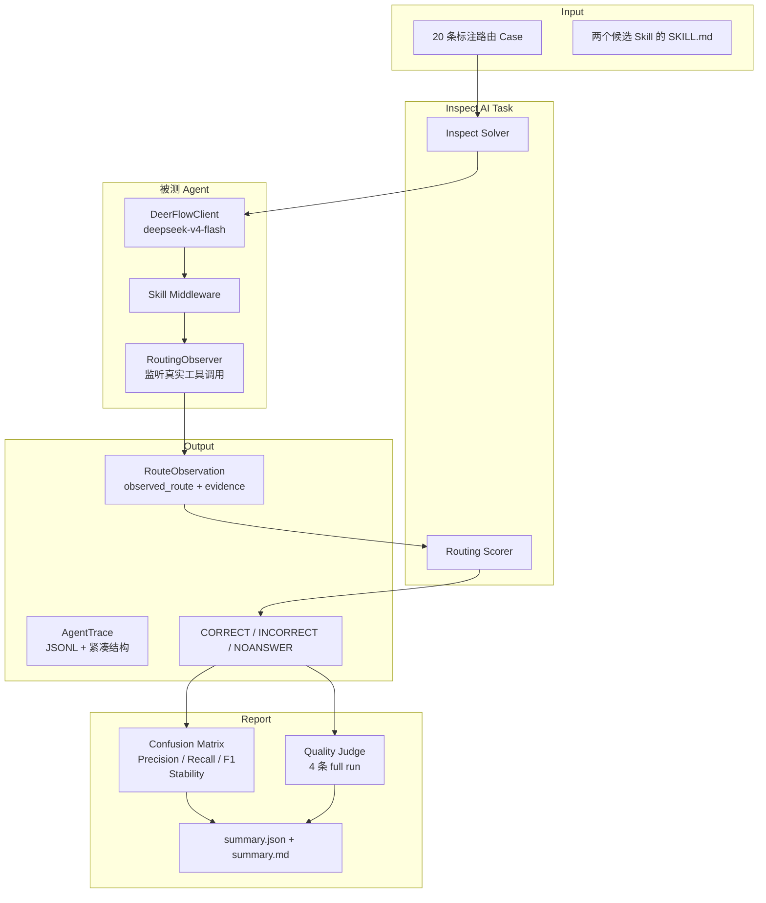

# DeerFlow Agent Routing POC 概述

**日期：** 2026-07-14
**提交：** `57c08e1e`
**分支：** `skill-eval-deerflow-adapter`

---

## 一句话总结

用 **Inspect AI** 驱动真实 **DeerFlow Agent**，评测它在两个相邻学术 Skill 之间的路由准确率，并对少量样本做端到端质量 Judge。

---

## 问题

DeerFlow 有多个内置 Skill。Agent 收到用户请求后需要自主选择是否加载 Skill、加载哪个 Skill。当前缺少一个可复现的评测手段来衡量：

- Agent 实际选了哪个 Skill（不是它声称选了哪个）
- 选择是否正确
- 选择是否稳定（同一请求多次运行结果一致）
- 选了正确 Skill 后，执行过程和质量是否达标

之前仓库里有一个基于断言的评测框架，但存在几个问题：

- 数据集只有 2 条 case，引用了不存在的 Skill
- 路由判定依赖"Agent 声称使用了某个 Skill"而非真实工具调用证据
- 把基础设施有效性、路由行为、过程质量、最终答案混成一个二值分
- 真实工具调用 case 跑了 300 秒超时

这个 POC 把问题收窄到一个可观测的主张：

> 给 Agent 一个请求和两个相邻学术 Skill，它实际选哪个？选得对不对？多稳定？选对之后产出质量如何？

---

## 架构



核心设计决策：

1. **不 mock Agent。** 每次运行 spawn 独立子进程，走真实 `DeerFlowClient` + `deepseek-v4-flash` + 本地 sandbox。
2. **路由证据来自真实工具调用流。** 不是从最终回答文本推测，也不是信任 Agent 的自我声明。
3. **路由评测和质量评测分开。** 60 次路由 run 只跑 probe 模式（拿到足够证据就停）；4 条质量 case 跑完整流程再交给独立 LLM Judge。
4. **基础设施失败不算路由错误。** 超时、子进程崩溃、pipe 传输失败记作 `NOANSWER`，不污染混淆矩阵。

---

## 评测的两个 Skill

| Skill | 职责 | 触发条件 |
|---|---|---|
| `systematic-literature-review` | 多篇论文综述、survey、annotated bibliography、跨论文比较 | 请求涉及多篇论文的综合分析 |
| `academic-paper-review` | 单篇论文深度评审、peer review、方法论评估 | 请求指定一篇具体论文 |

第三条隐含路径是 **none**：两个 Skill 都不应该加载。

两个 Skill 的职责定义写在各自的 `SKILL.md` 里，边界清晰——例如 `systematic-literature-review` 的文档明确写 "Not for single-paper tasks — use academic-paper-review for reviewing one paper."。

---

## 怎么判断路由是否正确

不靠看最终回答像不像用了某个 Skill，而是直接监听 DeerFlow 事件流中的**真实工具调用**。

### 证据链

```
1. AI 发起 tool_call: read_file("/mnt/skills/public/<skill>/SKILL.md")
   → 记录 load_requested

2. 收到对应 tool_call_id 的成功返回（不以 "Error:" 开头）
   → 记录 loaded

3. 同一批次只有一个 Skill 被成功加载
   → observed_route = 该 Skill 名

4. 同一批次有两个 Skill 都被成功加载
   → observed_route = ambiguous（判错）

5. Stream 正常结束，没有成功加载任何候选 Skill
   → observed_route = none
```

注意只是调用了 `describe_skill` 不算路由——必须真正 `read_file` 并成功返回才算。

### 正确性判定

```python
observed_route == expected_route  → CORRECT
observed_route != expected_route  → INCORRECT
运行未完成 / stream 中断           → NOANSWER（不计入混淆矩阵）
```

---

## 数据集

**文件：** `backend/cases/literature_skill_routing.jsonl`

**规模：** 20 条，8 / 6 / 6 分布

| 类别 | 数量 | 含义 |
|---|---|---:|
| `systematic-literature-review` | 8 | 需要跨论文综合 |
| `academic-paper-review` | 6 | 需要单篇论文深度评审 |
| `none` | 6 | 两个 Skill 都不该加载 |

**数据不是随便写的。** 每条 case 都有：

- `rationale`：解释为什么这样标
- `tags`：标注样本属性（explicit / implicit / keyword-collision / near-boundary / sibling-collision 等）

**防作弊约束（加载时强制校验）：**

- 必须正好 20 条
- 类别分布必须为 `8 / 6 / 6`
- 必须恰好 4 条带 `quality` 标签
- prompt 里不能直接写 Skill 名（防止泄漏标准答案）
- prompt 不能以 `/` 开头（防止 slash command 强制激活）

### 几条代表性样本

| 输入 | 期望路由 | 测试点 |
|---|---|---|
| "Survey transformer attention variants published in the last two years on arXiv cs.CL." | SLR | 明确 survey + 时间窗口 |
| "What does the literature say about RLHF? Synthesize 3 representative papers." | SLR | 隐式综述 |
| "Review this paper: https://arxiv.org/abs/2310.06825" | Paper Review | 指定 arXiv URL |
| "Write a constructive peer review for the single manuscript at https://arxiv.org/abs/2203.02155" | Paper Review | peer review 变体 |
| "Explain the difference between precision and recall with one simple example." | none | 学术相关但只需直接回答 |
| "Write a Python function that parses BibTeX files into dictionaries." | none | 关键词碰撞（BibTeX）但任务是写代码 |
| "What is attention in transformers?" | none | 与论文领域相关但只是概念问题 |
| "Find me one good introductory paper on reinforcement learning." | none | 找一篇论文但不要求评审 |

---

## 评测指标

### 路由指标（20 cases × 3 epochs = 60 runs）

| 指标 | 含义 | Acceptance |
|---|---|---|
| Valid Run Rate | 成功完成的比例（排除基础设施失败） | ≥ 0.95 |
| Macro Precision | 三个类别 precision 的等权平均 | ≥ 0.80 |
| Macro Recall | 三个类别 recall 的等权平均 | ≥ 0.80 |
| Macro F1 | Precision 和 Recall 的调和平均 | 报告但不做硬门槛 |
| Stability Rate | 同一 case 三次运行结果完全一致的比例 | 报告但不做硬门槛 |
| Confusion Matrix | 每个 (expected, observed) 组合的计数 | 报告 |

Precision 回答"Agent 选这个 Skill 的时候，有多少次确实该选"；Recall 回答"该选这个 Skill 的时候，Agent 有多少次真的选了"。用 macro average 而非总体准确率，避免某一类样本数量差异主导结果。

### 质量指标（4 条 full-run case）

4 条带 `quality` 标签的 case 走完整 Agent 流程，产出最终答案和 artifact，由独立 LLM Judge 在三个维度打分（1-5）：

- **Route Quality**：Skill 选择是否合理
- **Process Quality**：工具使用、工作流是否符合 Skill 定义
- **Output Quality**：最终答案的完整性、准确性、格式

通过条件：三个维度均 ≥ 3，且无 fatal error。Full 模式要求 4 条中至少 3 条通过。

### 失败分类

三种失败独立统计，互不混淆：

| 失败类型 | 含义 | 影响 |
|---|---|---|
| Infrastructure Failure | Agent 子进程崩溃、超时、pipe 失败 | 降低 valid run rate，计为 NOANSWER |
| Judge Failure | Judge 模型调用失败或返回无效结果 | 降低质量通过数 |
| Routing Error | Agent 选了错误的 Skill | 降低 precision / recall |

---

## 如何运行

```bash
cd backend

# Smoke（3 条 case，各 1 epoch，不跑 Judge）
AGENT_MODEL=<deerflow 中配置的模型名> \
JUDGE_MODEL=<inspect 可用的模型> \
uv run python -m skill_eval.poc --smoke

# Full（20 条 × 3 epochs + 4 条质量 Judge）
AGENT_MODEL=<deerflow 中配置的模型名> \
JUDGE_MODEL=<inspect 可用的模型> \
uv run python -m skill_eval.poc
```

输出位置：

```text
backend/eval-results/<run-id>/
├── summary.json    # 机器可读
├── summary.md      # 人类可读
└── traces/         # 每次运行的完整事件流（JSONL）
```

退出码：

| 退出码 | 含义 |
|---|---:|
| 0 | 所有 acceptance 通过 |
| 1 | 指标未达到 acceptance 阈值 |
| 2 | 评测本身无效（基础设施失败、数据不完整） |

---

## 当前 Smoke 结果

使用 `deepseek-v4-flash` 跑了一次三分类 smoke（3 条 case，各 1 epoch，耗时 ~38s）：

```text
planned_runs:            3
valid_runs:              3
valid_run_rate:          1.0

macro_precision:         1.0
macro_recall:            1.0
macro_f1:                1.0

infrastructure_failures: 0
judge_failures:          0
```

三条 case 全部正确：

| 输入 | 期望 | 实际 | 证据 |
|---|---|---|---|
| "Explain precision and recall" | none | none | 无 Skill 加载 |
| "Review this paper: arxiv.org/abs/2310.06825" | paper-review | paper-review | `load_requested` + `loaded` |
| "Survey transformer attention variants" | SLR | SLR | `load_requested` + `loaded` |

注意：Smoke 只是验证全链路能跑通、三类最小样本路由正确。需要跑 full 模式（60 次路由 + 4 条质量 Judge）才能得到有统计意义的结论。

---

## 已知局限

1. **数据集规模小。** 20 条适合 POC，不适合声称泛化能力。正式 benchmark 需要更多改写、中文请求、对抗样本。
2. **标注未经双人校验。** 当前 label 来自 Skill 文档职责 + 人工设计，未经过独立双人标注 + Cohen's κ 计算。
3. **`load_failed` 边界。** 当前 Agent 尝试加载 Skill 但读取失败时，最终可能被判为 `none`，对 expected=none 的样本存在理论上的假阳性风险（本次 smoke 的 none 样本未触发此问题）。
4. **Stability 不是硬门槛。** 报告会显示 stability_rate，但 acceptance 未设要求。
5. **只测了两个 Skill。** 扩展到更多 Skill 时需要处理多 Skill 组合、优先级等更复杂场景。
6. **Sandbox / 网络依赖。** 评测结果受 arXiv 可用性、本地 sandbox 状态影响，不是纯模型能力衡量。

---

## 技术要点（给想深入了解的人）

### 子进程隔离

每次 Agent run 在独立 `multiprocessing.Process` 中执行，通过 `Connection` (pipe) 传回结果。关键设计：

- 父进程**先读完 pipe payload 再 join 子进程**，避免大 payload 导致 pipe 缓冲区满 → 死锁
- 子进程返回结果后给 **5 秒退出宽限**；超时未退出则强制 terminate 并返回 infrastructure failure
- 父进程超时后 terminate + join 回收子进程，不泄漏

### Trace 设计

不再保存完整原始事件流到内存，而是提取紧凑的 `AgentTrace`：

- tool_calls（函数名、参数、结果截断）
- messages（AI / tool 消息）
- artifacts（SHA-256 + 首尾内容 + 截断标记）
- route_observation（路由证据）
- token 用量、延迟、错误

完整原始事件流增量写入 JSONL，保留可审计性但不进入 scorer / judge。

### 为什么不用 LLM 判断路由

路由是一个可观测的事实（Agent 是否调用了 `read_file(".../SKILL.md")`），不需要 LLM 来猜。LLM Judge 只在端到端质量评测中使用——判断过程质量、输出质量这些无法用确定性规则衡量的事情。

---

## 相关文件

| 文件 | 说明 |
|---|---|
| `backend/skill_eval/poc.py` | POC 主入口，preflight + run_poc |
| `backend/skill_eval/routing.py` | RoutingObserver：监听工具调用，提取路由证据 |
| `backend/skill_eval/adapters/deerflow.py` | DeerFlowAgentRunner：spawn 子进程，pipe 传输 |
| `backend/skill_eval/inspect_scorer.py` | routing_scorer + quality_judge_scorer |
| `backend/skill_eval/report.py` | 指标聚合 + JSON / Markdown 报告 |
| `backend/skill_eval/judge.py` | LLM Judge：对 full run 做三维质量评分 |
| `backend/skill_eval/case_schema.py` | RoutingCase 数据契约 |
| `backend/skill_eval/dataset_loader.py` | 数据加载 + 防作弊校验 |
| `backend/cases/literature_skill_routing.jsonl` | 20 条标注路由 case |
| `backend/tests/skill_eval/` | 83 个 POC 测试（全部通过） |
| `docs/superpowers/specs/2026-07-13-agent-routing-eval-poc-design.md` | 完整设计文档 |
